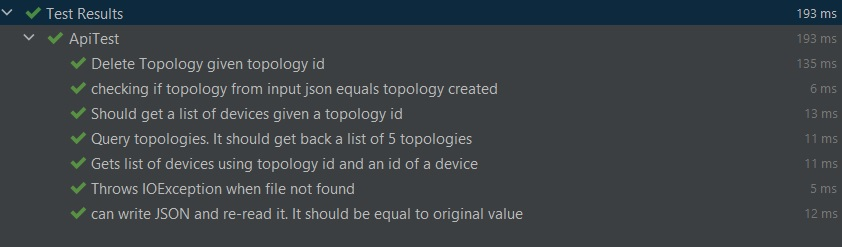

# Topology_API

## Javadoc
You can read the documentation at
[Link to Javadoc] https://topolog-api-docs.netlify.app/org/example/topologyapi/package-summary.html

## Why Java?
I chose to write the API in java for the following reasons:
I wanted to try to learn Java in a limited time span.
Java is object-oriented.
This allows you to create modular programs and reusable code.
Java is platform-independent so the code can run on multiple platforms.
Because of Java's robustness, ease of use, cross-platform capabilities and security features, it has become a language of choice for providing worldwide Internet solutions.

Java manages memory through the garbage collector so it's also memory efficient.

## Build Tool
I used Maven to build the project.

## Unit Testing
unit testing was done using JUnit

## Static Code Analysis
Style code analysis was done using checkstyle

